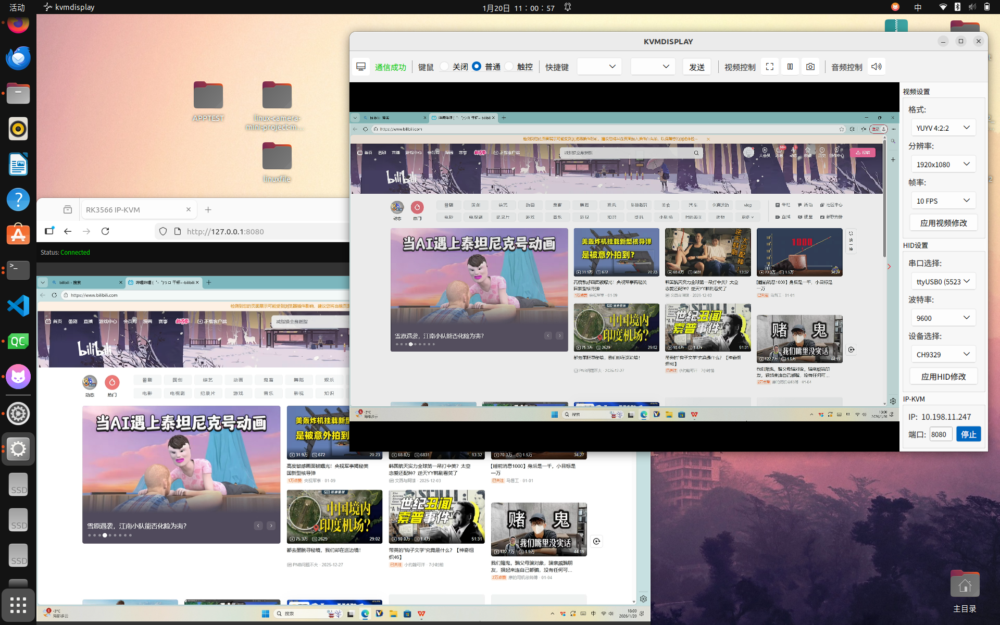
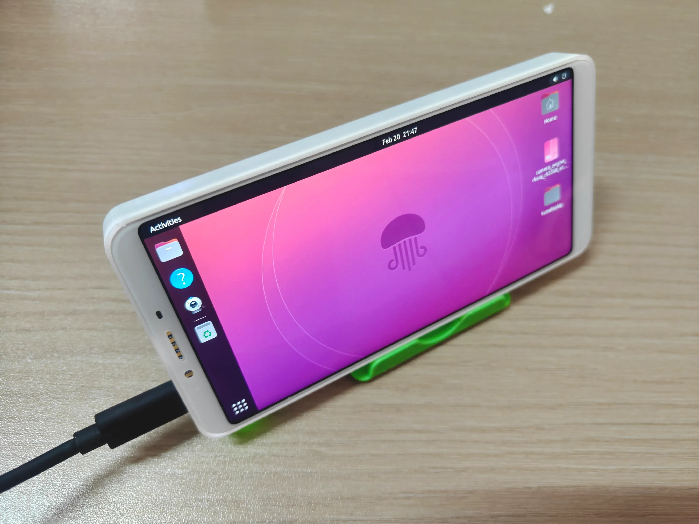
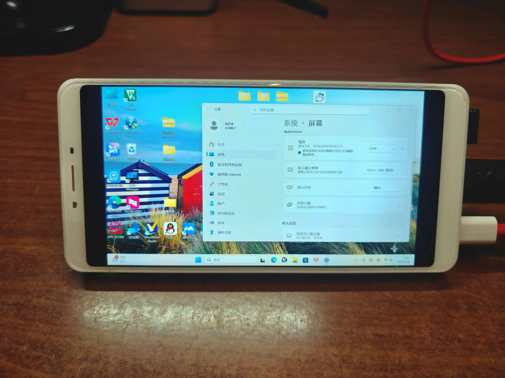

# Pocket-KVM

一个基于 Qt/C++ 开发的高性能嵌入式 **KVM (Keyboard, Video, Mouse)** 解决方案。该项目运行在 Linux 平台上，通过 V4L2 采集 HDMI 视频信号，同时支持本地键鼠控制 (HID) ，通过 CH9329 硬件模拟器发送给被控端。

演示视频：https://www.bilibili.com/video/BV1XbXwBdEk5



<!--
<div style="display: flex; justify-content: center; gap: 20px; flex-wrap: wrap;">
  
  
</div>
-->

## 一、硬件说明

本项目硬件方案由以下四部分组成：

- 主控平台：`RK3566`（泰山派）
- 高清显示屏：`TL060FVX08/7`（魅族E3同款）
- 视频采集链路：`TC358743`（HDMI 转 MIPI CSI）
- 键鼠注入链路：`CH9329`（串口转 HID）

<!--整体工作流程：被控主机 HDMI 输出 → `TC358743` 转 CSI → `RK3566` 采集编码推流；
本地/Web 端输入事件 → `RK3566` 串口下发 → `CH9329` 模拟 HID 回传给被控主机。 -->
硬件原理图、PCB 和连接说明请参考开源硬件项目：

https://oshwhub.com/trumpx/pocket-kvm

## 二、系统修改

本软件在 `Ubuntu 22.04`（内核 `5.10`）环境验证通过，底层系统基于泰山派 SDK：

https://github.com/CmST0us/tspi-linux-sdk

建议先完整编译一次原始 SDK，确认基础环境正常后再进行以下修改。

### 2.1 修改设备树（显示 / 采集 / 串口）

1. **DSI 显示设备树**

   将本工程 `sys_conf/tspi-rk3566-dsi-v10-天马6寸1080p屏幕.dtsi` 的内容复制到：

   ```config
   tspi-linux-sdk/kernel/arch/arm64/boot/dts/tspi-rk3566-dsi-v10.dtsi
   ```

2. **CSI 采集设备树**

   将本工程 `sys_conf/tspi-rk3566-csi-v10-TC358743修改.dtsi` 的内容复制到：

   ```config
   tspi-linux-sdk/kernel/arch/arm64/boot/dts/tspi-rk3566-csi-v10.dtsi
   ```

   请确认 `tspi-linux-sdk/kernel/arch/arm64/config/rockchip_linux_defconfig` 中已启用驱动：

   ```config
   CONFIG_VIDEO_TC35874X=y
   ```

3. **启用串口 `ttyS0`（用于 CH9329）**

   在 `tspi-linux-sdk/kernelarch/arm64/boot/dts/rockchip/tspi-rk3566-user-v10-linux.dts` 中启用串口0：

   ```config
    //用户串口0
    &uart0 {
	status = "okay";
	pinctrl-names = "default";
	pinctrl-0 = <&uart0_xfer>;
    };
   ```
 
### 2.2 增加触摸驱动（`my_sec_ts`）

1. 复制驱动目录：

   将本工程中 `sys_conf/my_sec_ts` 文件夹复制到：

   `tspi-linux-sdk/kernel/drivers/input/touchscreen/`

2. 在同目录下的 `Makefile` 中添加：

   ```makefile
   obj-$(CONFIG_TOUCHSCREEN_SEC_TS_1223) += my_sec_ts/
   ```

3. 修改同目录下的 `Kconfig` 文件：

   在 `if INPUT_TOUCHSCREEN` 后增加：

   ```kconfig
   source "drivers/input/touchscreen/my_sec_ts/Kconfig"
   ```

4. 修改配置文件
   
   在 `kernel/arch/arm64/configs/panfrost.config` 中添加：

   ```config
   CONFIG_TOUCHSCREEN_SEC_TS_1223=y
   ```

### 2.3 重新编译并烧录内核

进入 SDK 根目录后执行：

```bash
cd tspi-linux-sdk
sudo ./build.sh kernel
sudo ./rkflash.sh boot
```


### 2.4 DEBUG与调试

1. 将 Pocket-KVM 的泰山派侧使使用TYPE-C 数据线接入电脑，进入adb模式：
  
   ```bash
   adb shell
   ```
2. 观测显示屏显示是否正常，若不正常请检查焊接。
3. 串口一般不会出现问题。
3. TC358743 初始化成功判定：

   注意，仅出现下述情景才代表TC358743初始化成功：
   ```bash
    root@neonsboard: dmesg | grep tc358
    [    5.141057] tc35874x 4-000f: driver version: 00.01.01
    [    5.179549] rockchip-csi2-dphy csi2-dphy0: dphy0 matches m00_b_tc35874x 4-000f:bus type 5
    [    5.278796] m00_b_tc35874x 4-000f: tc358743 found @ 0x1e (rk3x-i2c) 
    root@neonsboard: v4l2-ctl -d /dev/v4l-subdev3 --log-status
    #输出：m00_b_tc35874x 4-000f: DDC lines enabled: yes 
   ```
       


## 三、KVM软件部分


等待添加